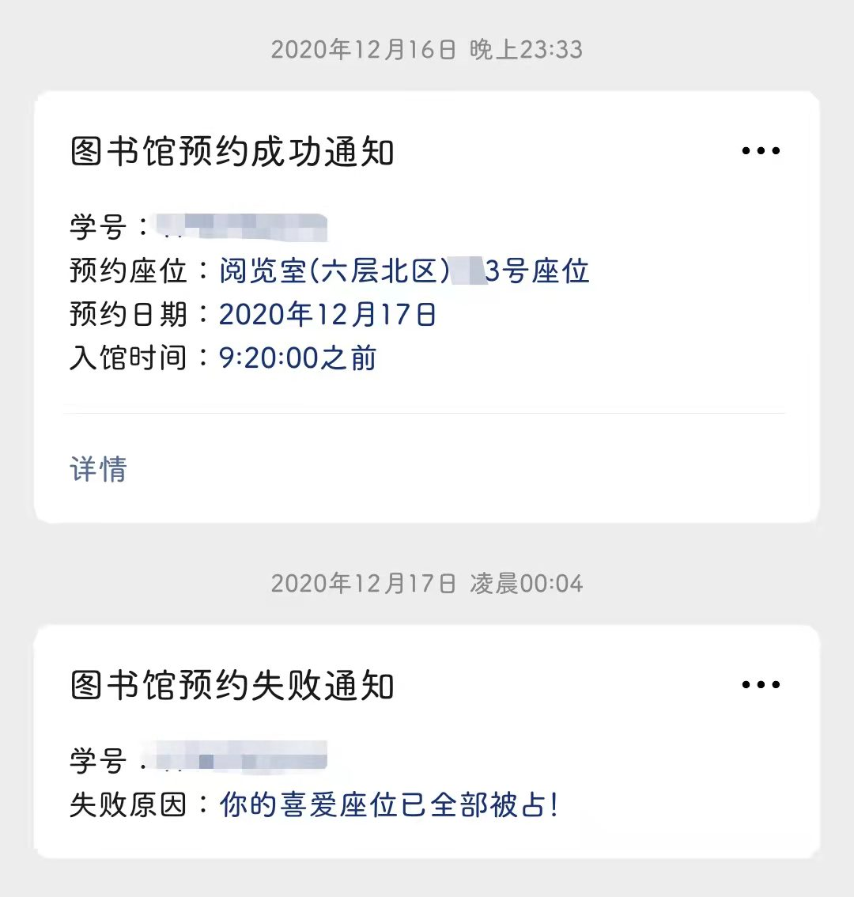
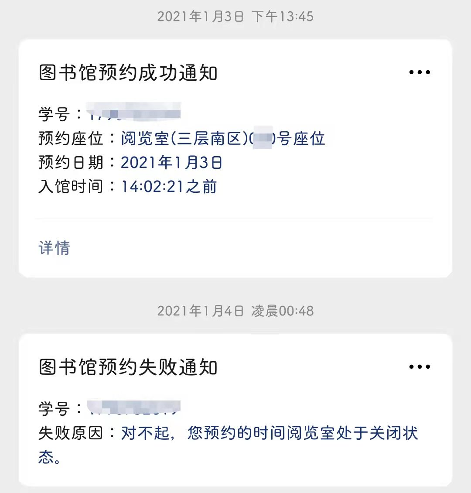
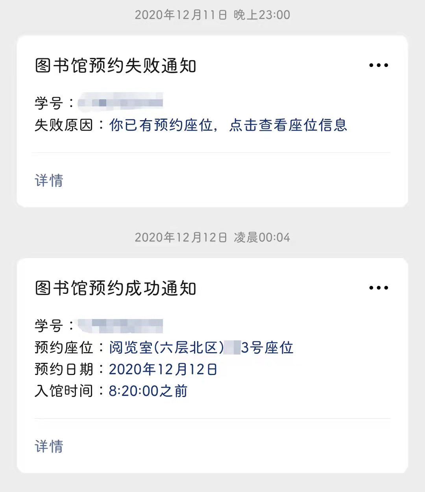

# 河北科技大学图书馆占座系统

* 使用须知：
  * 适用于新校区图书馆微信预约系统
  * 代码初写于图书馆预约系统上线之初，本人最后使用于2021年5月可正常使用，后已毕业，未再测试。因学校预约系统可能会有更新，不确保目前可开箱即用，但代码核心逻辑一般没有问题。
  * 微信推送功能需拥有微信公众号的服务号或测试号，订阅号没有推送权限，测试号申请和使用请参考微信开发者平台官方文档
  * 代码源于本人兴趣，请勿将本程序用于盈利或大规模使用，不当使用造成不良后果由使用者个人承担。

* 使用步骤
  * 于官方预约系统添加喜爱座位（即为本系统目标座位）
  * python3运行环境
  * 安装依赖包

    ```bash
    pip install -r requirements
    ```

  * 修改代码内用户信息及微信公众号信息

    ```python
    # 用户类，包含学号，密码，预约时间，用户微信对推送公众号的openid
    class user(object):
        def __init__(self, stuNum, pwd, time, weChat):
            self.stuNum = stuNum
            self.pwd = pwd
            self.time = time
            self.weChat = weChat
    # 此处存储用户信息
    users = [
        user('user1', 'password', '9:00', 'oCLvE53QWS8tOJEUZaCkJ3miwe5k'),
        user('user2', 'password', '10:00', 'oCLvE53QWS8tOJEUZaCkJ3miwe5k')
    ]
    ```

    ```python
    # 微信公众号
    class WeChatPush():
        def __init__(self):
            # 微信公众号app_id
            app_id = 'wxapp_id'
            # 微信公众号app_secret
            app_secret = 'd0c9cf48b4ce7e30a60e14052251c535'
            url = f'https://api.weixin.qq.com/cgi-bin/token?grant_type=client_credential&appid={app_id}&secret={app_secret}'
            dict = requests.get(url).json()
            self.token = dict['access_token']
    ```

  * 运行程序

    ```bash
    python3 hebust_linrary.py
    ```

* 推送效果展示


* 可选操作及建议
  * 将程序部署到远程服务器或openwrt路由器，添加crontab自动计划
  * 构建后端服务器，只推送抢座提醒，待用户于微信确认抢座后触发对应用户的抢座程序
